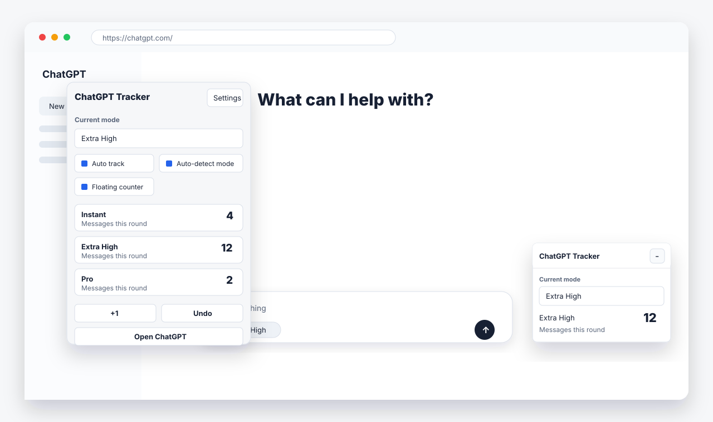

# ChatGPT Message Tracker

[English](README.md) · [简体中文](README.zh-CN.md) · [日本語](README.ja.md) · [한국어](README.ko.md) · **Español** · [Français](README.fr.md)

Una extensión local de Chrome que cuenta los mensajes que **tú** envías en el sitio web de ChatGPT, agrupados por modo (`Instant`, `Medium`, `High`, `Extra High`, `Pro`), para que siempre sepas cuánto has usado realmente.

> **Contador local independiente. No está afiliado a OpenAI ni cuenta con su respaldo.**
> No consulta cuotas oficiales, no predice el saldo restante ni ofrece datos oficiales de uso de OpenAI.



---

## Instalación

No hace falta compilar nada: carga la extensión directamente desde este repositorio.

1. Clona o descarga este repositorio (descomprime el archivo si es necesario).
2. Abre Chrome y ve a `chrome://extensions/`.
3. Activa el **modo de desarrollador** en la esquina superior derecha.
4. Haz clic en **Cargar descomprimida** y selecciona la carpeta raíz del proyecto (la que contiene `manifest.json`).
5. Abre o recarga [https://chatgpt.com/](https://chatgpt.com/): aparecerá un contador flotante en la esquina inferior derecha de la página.

## Cómo se usa

1. **Simplemente envía mensajes.** Al enviar, la extensión lee el modo seleccionado junto al cuadro de texto y registra `+1` para ese modo una vez que tu mensaje aparece de verdad en la conversación.
2. **Mira el contador flotante** de la página o haz clic en el icono de la extensión para abrir la ventana emergente con los recuentos por modo, `+1` y **Deshacer**.
3. **Corrige errores en cualquier momento.** Los recuentos perdidos o duplicados se corrigen con `+1`, **Deshacer** o eliminando registros recientes.
4. **Si la detección automática falla**, abre la ventana emergente y desactiva **Detectar modo** para contar en el modo seleccionado manualmente.
5. **Más opciones en la página de ajustes**: renombrar modos, añadir modos personalizados, ver estadísticas por período y diarias, exportar datos en JSON o borrar registros.

Lo siguiente **no** se cuenta por error: confirmar un candidato del IME con Intro, pulsar Intro mientras se genera una respuesta, borrar un borrador o detener una respuesta.

## Funciones

- Cuenta los mensajes enviados por modo: `Instant`, `Medium`, `High`, `Extra High`, `Pro`, además de modos personalizados.
- Contador flotante directamente en la página de ChatGPT.
- Detección automática del modo en el momento del envío, basada en el idioma y las etiquetas de la propia página de ChatGPT; no adivina a partir del idioma del navegador.
- Interfaz disponible en 21 idiomas, siguiendo el idioma del navegador.
- Estadísticas por período (últimas 3 horas / 24 horas / 7 días / 30 días) y estadísticas diarias por modo.
- Correcciones manuales: `+1`, deshacer y eliminar registros recientes.
- Exporta ajustes y registros de uso en JSON.
- Todo se guarda en tu equipo, en el almacenamiento local de la extensión de Chrome.

## Privacidad

Esta extensión nunca sube datos ni guarda el contenido de las conversaciones. Para confirmar los envíos y evitar recuentos dobles, compara temporalmente el borrador con los mensajes nuevos en la memoria de la página; esos estados temporales desaparecen al cerrar la página. Cada registro guardado contiene solo:

- ID del modo
- Marca de tiempo
- Origen del registro (botón de envío, tecla Intro o entrada manual)

Consulta la [política de privacidad](PRIVACY.md) completa para más detalles.

## Limitaciones

- Solo funciona en el perfil de Chrome donde está instalada la extensión.
- Solo cuenta mensajes enviados en el sitio web de ChatGPT; no la aplicación móvil, otros navegadores ni otros dispositivos.
- La detección automática depende de la interfaz de ChatGPT; si ChatGPT cambia su diseño, puede que los selectores necesiten una actualización.
- Es un contador local personal, no un medidor oficial de uso de OpenAI.

## Actualización

Después de descargar código nuevo o hacer cambios, ve a `chrome://extensions/` y haz clic en el botón de recarga de la tarjeta **ChatGPT Message Tracker**.

## Desarrollo

```sh
npm ci            # instala dependencias
npm run check     # comprobaciones estáticas
npm test          # pruebas unitarias
npm run test:chrome   # carga la extensión real en un perfil aislado de Chrome con páginas de prueba locales
```

El reconocimiento de etiquetas de modo incluye evidencia para 21 variantes de idioma/región; las fuentes, las claves de mensaje originales y los hashes SHA-256 están en `docs/site-language-evidence.json`. Para reverificarlas:

```sh
node --expose-gc tools/verify-evidence.mjs /path/to/exported-official-assets
```

## Empaquetado para Chrome Web Store

```sh
npm ci
npm run check
npm test
python3 tools/build_release.py
```

El script genera en `dist/` el zip de la extensión listo para subir y un `publish-kit.zip` (materiales del publicador, **no** lo subas). La carpeta `store/` contiene los textos de la ficha, las justificaciones de permisos/privacidad y capturas reales de la interfaz. La lista completa está en `store/PUBLISHING.md`.
