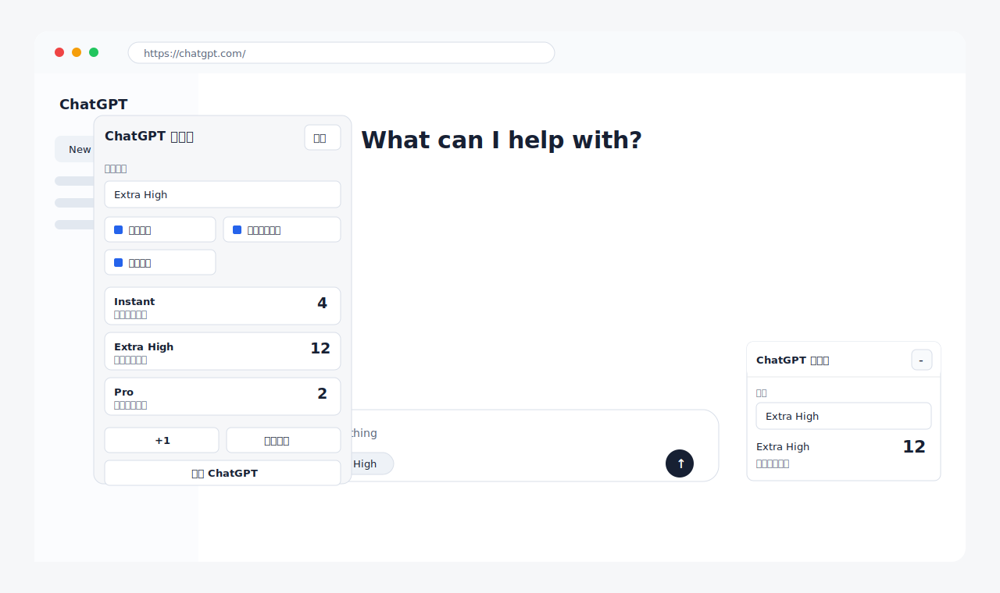

# ChatGPT Message Tracker

## 中文介绍

ChatGPT Pro 对提问次数有明显限制，尤其是 `Pro` 等高强度模式的可用次数更有限。这个扩展的目的很简单：在你使用 ChatGPT 网页版时，按模式记录已经发送了多少次消息，让你能随时知道自己的使用情况。

它是一个本地 Chrome 扩展，只做个人计数记录，不用于绕过、预测或替代 OpenAI 官方的用量限制。

### 功能

- 按模式统计发送次数：`Instant`、`Medium`、`High`、`Extra High`、`Pro`。
- 在 ChatGPT 页面右下角显示计数浮窗。
- 发送消息的瞬间自动识别输入框旁选中的 ChatGPT 模式，并按它计数。
- 支持手动选择模式、手动 `+1`、撤销、删除最近记录。
- 支持查看累计统计和最近时间范围统计。
- 支持导出设置和使用记录为 JSON。
- 所有数据只保存在本机 Chrome 扩展存储中。

### 界面预览

### 安装

1. 打开 Chrome，进入 `chrome://extensions/`。
2. 打开右上角的「开发者模式」。
3. 点击「加载已解压的扩展程序」。
4. 选择项目根目录，也就是包含 `manifest.json` 的文件夹。
5. 打开或刷新 `https://chatgpt.com/`。

### 使用方式

1. 在页面浮窗或扩展弹窗里选择当前模式。
2. 发送消息时，扩展会先读取输入框旁选中的模式，给识别到的模式记录 `+1`；识别不到时记给手动选中的模式。
3. 如果自动识别不准，可以在弹窗里关闭「自动识别模式」，改为手动选择。
4. 如果漏记或多记，可以用 `+1`、撤销或删除最近记录来修正。
5. 在设置页可以重命名模式、添加自定义模式、导出数据或清空记录。

### 隐私

这个扩展不会上传数据，也不会读取或保存你的对话内容。每条记录只包含：

- 模式 ID
- 时间戳
- 记录来源，例如发送按钮、回车或手动记录

### 限制

- 只在安装了此扩展的 Chrome 用户配置中生效。
- 只统计 ChatGPT 网页端发送的消息。
- 不会统计手机 App、其他浏览器或其他设备上的使用。
- 自动识别依赖 ChatGPT 页面 UI，如果 ChatGPT 改版，可能需要更新选择器。
- 它是本地计数器，不是 OpenAI 官方用量统计。

### 更新

修改代码后，回到 `chrome://extensions/`，点击 `ChatGPT Message Tracker` 扩展卡片上的刷新按钮。

## English Introduction

ChatGPT Pro has meaningful message limits, especially for high-intensity modes such as `Pro`. This extension is built to solve one practical problem: when you use ChatGPT on the web, it counts how many messages you have sent in each mode so you can keep track of your usage.

It is a local Chrome extension for personal tracking only. It is not designed to bypass, predict, or replace OpenAI's official usage limits.

### Features

- Tracks messages by mode: `Instant`, `Medium`, `High`, `Extra High`, and `Pro`.
- Shows a small floating counter on ChatGPT pages.
- Detects the mode selected next to the composer at the moment a message is sent, and counts against it.
- Supports manual mode selection, manual `+1`, undo, and deleting recent entries.
- Shows total counts and recent time-window counts.
- Exports settings and usage records as JSON.
- Stores everything locally in Chrome extension storage.

### UI Preview

### Install

1. Open Chrome and go to `chrome://extensions/`.
2. Enable **Developer mode**.
3. Click **Load unpacked**.
4. Select the project root folder that contains `manifest.json`.
5. Open or refresh `https://chatgpt.com/`.

### Usage

1. Choose the current mode in the floating widget or extension popup.
2. When you send a message, the extension reads the mode selected next to the composer and records `+1` for it, falling back to the manually selected mode if detection fails.
3. If automatic detection is inaccurate, turn off **Auto detect mode** in the popup and select the mode manually.
4. Use `+1`, undo, or recent-entry deletion to correct records.
5. Use the options page to rename modes, add custom modes, export data, or clear records.

### Privacy

This extension does not upload data. It does not read or store your conversation content. Usage entries contain only:

- mode id
- timestamp
- record source, such as send button, Enter key, or manual entry

### Limitations

- It only works in the Chrome profile where the extension is installed.
- It only tracks messages sent from ChatGPT web pages.
- It cannot track ChatGPT mobile apps, other browsers, or other devices.
- It relies on ChatGPT page UI signals, so future ChatGPT UI changes may affect automatic detection.
- It is a local counter, not an official OpenAI usage meter.

### Update

After changing the code, go to `chrome://extensions/` and click the reload button on the `ChatGPT Message Tracker` extension card.
